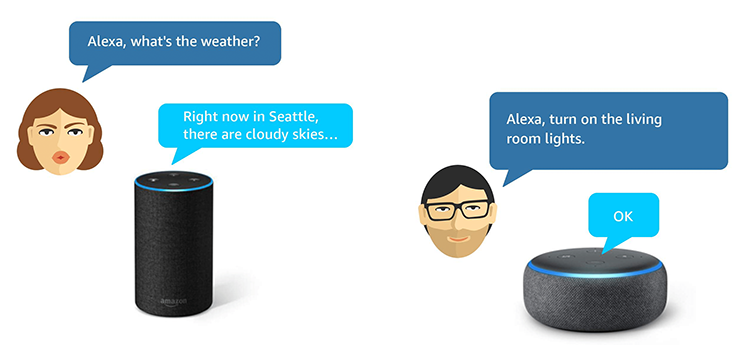
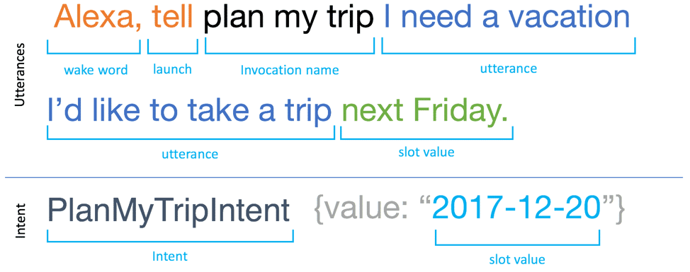
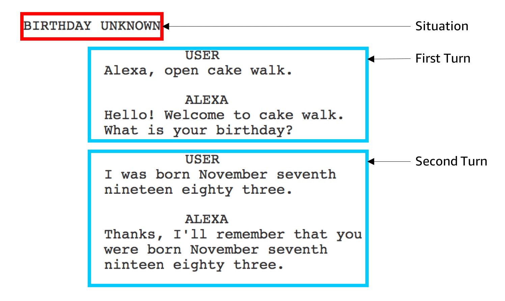
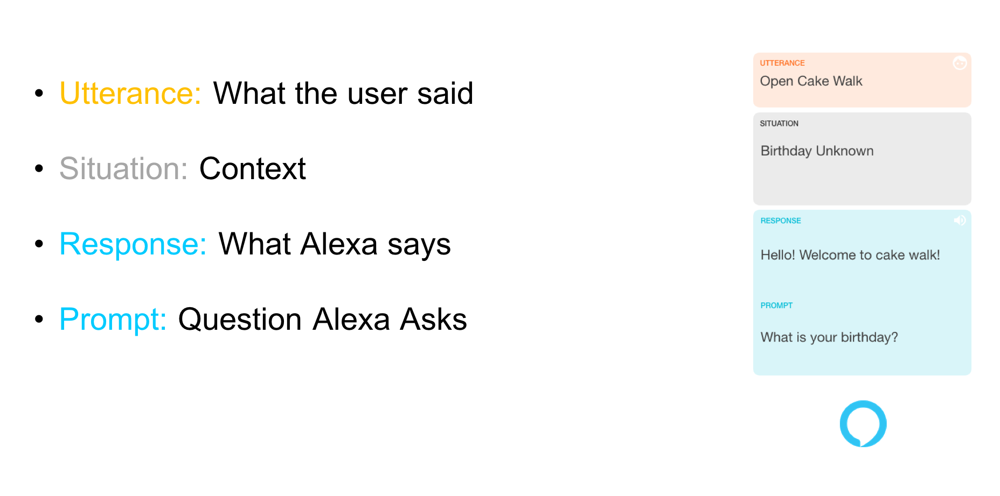
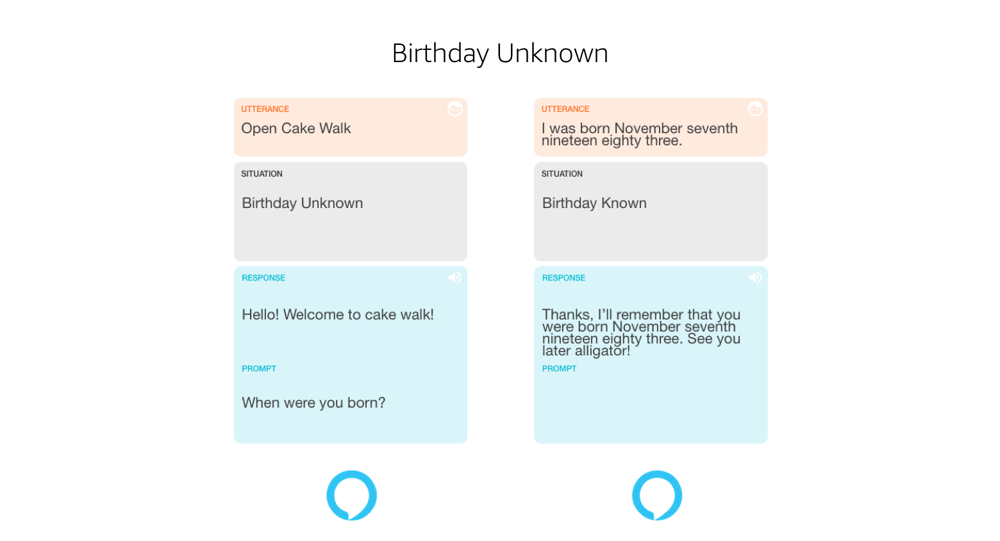
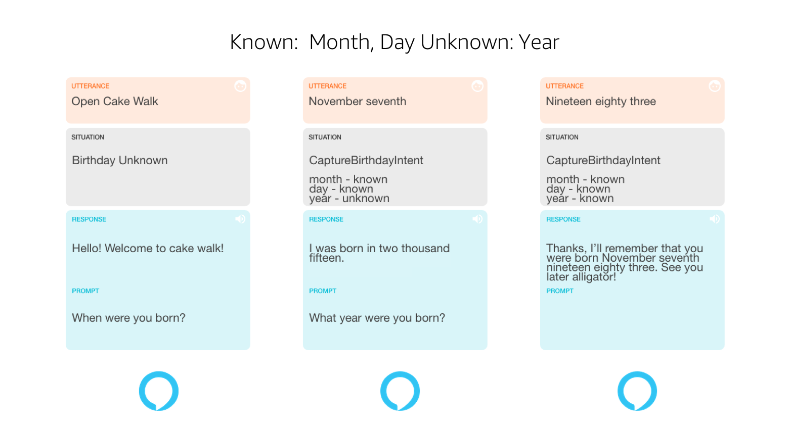
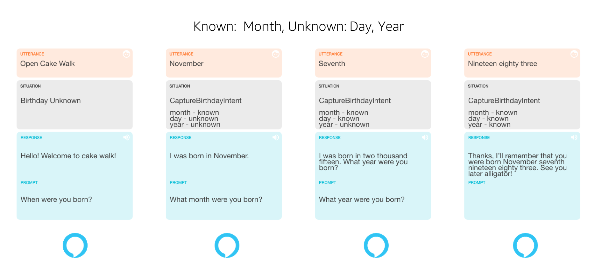
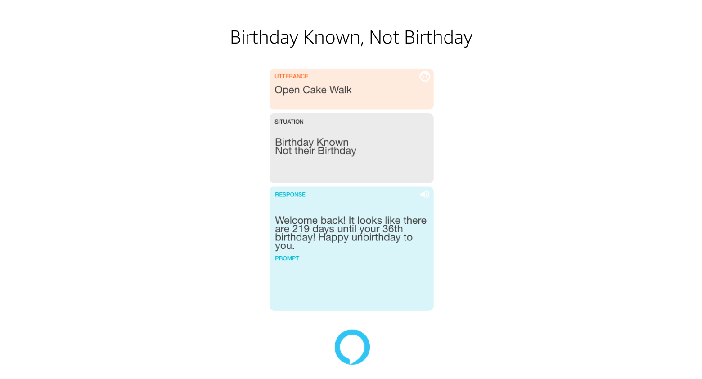
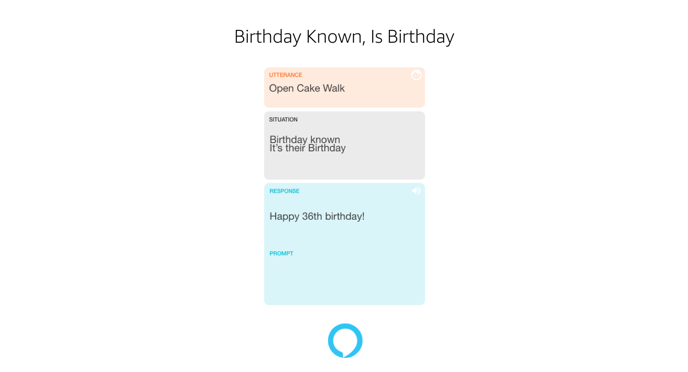

# An introduction to Alexa

## Table of Contents
1. [Overview](#overview)
2. [Setup](#setup)
3. [Skills](#skills)
4. [Basic Voice User Interface Design](#basic-voice-user-interface-design)

## Overview

Alexa is a virtual assistant technology that was developed by Amazon. It's capable of voice interactions and can be extended with the use of skills.

As part of the project you have been assigned you and your team will be designing and implementing a skill to solve the requirements of the design brief that has been supplied.

Amazon provide a simple introductory course to creating a skill, the [cakewalk](https://developer.amazon.com/en-US/alexa/alexa-skills-kit/resources/training-resources/cake-walk). If possible this should be worked though as this guide will provide only provide the basics.

## Setup

To complete this project you will need the following:

* An [Amazon Developer Account](https://developer.amazon.com/en-GB/alexa)
 * You are strongly advised to use your college email account for this. If you use your personal one then the developer account will be linked.

* A Github account as all team work will be stored in a group repository
 * A normal [Github](https://github.com/) account will be fine, however consider claiming the [Student Developer Pack](https://education.github.com/pack)

* [Github Desktop](https://desktop.github.com/)
 * Whilst it's entirely possible to use the web based interface for Github, the Desktop will make your workflow easier to handle. It's also free to use at home or on a personal device (at your own risk of course)

* [Visual Studio Code](https://code.visualstudio.com/) or a *simple* IDE of your choosing.
 * VSC is installed on the college computers. It is also free to use at home or on a personal device (at your own risk of course)

## Skills
[ref: Intro to Alexa Skills](https://developer.amazon.com/en-GB/alexa/alexa-skills-kit/resources/training-resources/cake-walk/cake-walk-1)

This project will require what is known as a *custom* skill. This allows you to design and build whatever you may think of. The [Alexa Skills Kit](https://developer.amazon.com/en-GB/alexa/alexa-skills-kit) also provides prebuilt models to help you start quickly via a set of API interfaces.

### How do Skills Work?

1. The user launches the skill via Alexa. *"Alexa, open Hello World"*
2. Alexa responds by sending the *utterance* to the Alexa service in the cloud where it is processed and converted to text.
3. The text is encoded as a [JSON](https://www.w3schools.com/js/js_json_intro.asp) request to a AWS [Lambda](https://aws.amazon.com/lambda/) function which acts as the backend for this *intent*. The Lambda service lets you run code without the headache of provisioning or managing servers.
4. The Lambda, having processed the request, sends a response back. This eventually ends back up at the requesting alexa and is presented to the user.

[YouTube: Interacting with a simple hello world alexa skill](https://youtu.be/cakcsuzS2DY)

Before we get to the code phase we need to design the Voice User interface.

## Basic Voice User Interface Design
[ref: Design an Engaging VUI](https://developer.amazon.com/en-GB/alexa/alexa-skills-kit/resources/training-resources/cake-walk/cake-walk-2)

[ref: Designing the Voice User Interface (VUI) for Your Alexa Skill](https://developer.amazon.com/blogs/alexa/post/f26e61af-82c5-426c-91f7-ed46e581dc48/getting-started-with-the-cake-walk-course-designing-the-voice-user-interface-vui-for-your-alexa-skill)

[YouTube: How to Build an Engaging Alexa Skill: Start with Situational Design [Part 1]](https://youtu.be/pyV4dX2HYxE)

### How users interact...

Here we can see two interactions. The first is asking for the weather and the second is asking Alexa to turn on the living room lights. How does the Alexa service understand this?
The Alexa service breaks the interaction down like this:

**Wake Word**: The word that tells Alexa to start listening to you

**Launch word**: The action that the Alexa use for the skill. For example *ask*,*open*,*launch* and *use*

**Invocation name**: The name of the skill to be used. In the image above this will be a skill called *plan my trip*

**Utterance**: The user's spoken request. This can, for example, invoke a skill or confirm an action for alexa. In the example it is *I need a vacation*

**Prompt**: Not shown above bu is a string of text that the Alexa uses to ask for information. It's normally included in your response to a customer's request.

**Intent**: An action that is executed to fulfil a user's spoken request. They can have optional arguments called slots.

**Slots value**: Used to store input values form the spoken request.   

### Let's begin a voice design

So far, as part of other modules, you will have been taught to use flowcharts to map a path for your code to follow and it may be tempting to follow the process here as well. **Don't!**..Flow charts are not conversational and will result in a poor design. Instead, consider using Situational Design.

#### Situational Design

Situational Design is a voice-first method to design a voice user interface (VUI).

You start with a simple dialog which helps keep the focus on the conversation. Each interaction between your customer and the skill represents a turn.

 Each turn has a situation that represents the context. If it's the customer's first time interacting with the skill, there is a set of data that is yet unknown. Once the skill has stored the information, it will be able to use it the next time the user interacts with the skill.

 

The example above shows how the Alexa interacts with the cake walk skill in a situation where the users birthday is unknown.

The first turn deals with users providing the utterance *open cake walk* to which Alexa responds with a welcome and asks for the the users birthday. The second turn shows how the user replies and Alexa informing that it'll remember the users birthday.

This layout is fine for a simple interaction but a better way would be to break each turn into a set of cards that can be laid out in a story board fashion.

This layout is bit easier to read and follow. Expanding it to include the second turn from before changes it to:

Here the another batch of cards are added showing how the second turn is included. Note how the situation has changed to to birthday known and that the prompt is left empty. As the interaction has ran it's course and Alexa has already said good bye then there is no requirement for any prompts.

So far this design assumes that the user will provide the correct birthday data however this may not always be the case. This means that all possible verbal interactions should be considered an planned for. The example below shows the design if the month and day is known but the year is not.

All that we had to do was to insert a new set of cards and move the confirmation cards to the right. In the new card we see the utterance is *November Seventh* and Alexa now uses the prompt to ask what year the user was born. It also shows that the situation card can hold the intent that would be called and the slots which are awaiting data.

So how can we handle just user just giving the month?

We just add another card and work the conversation through. There is also an error im the image above...can you find it?

Finally we can produce cards showing what happens when the code knows the birthday of the user and when it is their birthday.

 

### Characteristics of a Well-Designed Voice User Interface

**Uses natural forms of communication**

When talking with a machine, a user should not be required to learn a new language or remember the rules. A machine should conform to the user's paradigm, not the other way around.

**Navigates through information easily**

Your skill’s VUI should offer an easy way to cut through layers of information hierarchy by using voice commands to find important information.

**Creates an eyes- and hands-free experience**

Voice interfaces should allow a user to perform tasks while their eyes and hands are occupied.

**Creates a shared experience** 

Voice experiences let users collaborate, contribute, or play together through natural conversation. For example, a family could play a game together on an Alexa-enabled device.

### Five Best Practices

1. **Stay close to Alexa's persona**

  Alexa's personality is friendly, upbeat, and helpful. She's honest about anything blocking her way but also fun, personable, and able to make small talk without being obtrusive or inappropriate.

  Try to keep the tone of your skill’s VUI as close to Alexa’s persona as possible. One way to do this is by keeping the VUI natural and conversational.

  Slightly vary the responses given by Alexa for responses like "thank you" and "sorry". Engaging the user with questions is also a good technique for a well-designed VUI.

2. **Write for the ear, not the eye**

  The way we speak is far less formal than the way we write. Therefore, it's important to write Alexa’s prompts to the user in a conversational tone.

  No matter how good a prompt sounds when you say it, it may sound odd in text-to-speech (TTS).

  It is important to listen to the prompts on your test device and then iterate on the prompts based on how they sound.

3. **Be contextually relevant**

  List options in order from most to least contextually relevant to make it easier for the user to understand. 

  Avoid giving the user options in an order that changes the subject of the conversation, then returns to it again. 

  This helps the user understand and verbalise their choices better without spending mental time and energy figuring out what's most relevant to them. 

4. **Be brief**

  Reduce the number of steps to complete a task wherever possible to keep the conversation brief. Simplify messages to their essence wherever possible.

5. **Write for engagement to increase retention**

  Alexa skills should be built to last and grow with the user over time. Your skill should provide a delightful user experience, whether it's the first time a user invokes the skill or the 100th.

  Design the skill to phase out information that experienced users will learn over time. Give fresh dialog to repeat users so the skill doesn't become tiresome or repetitive.
